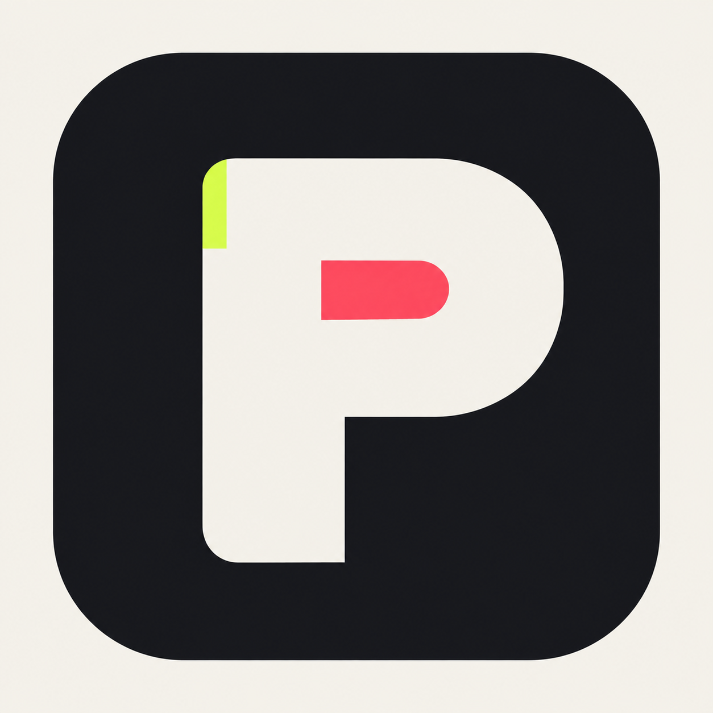
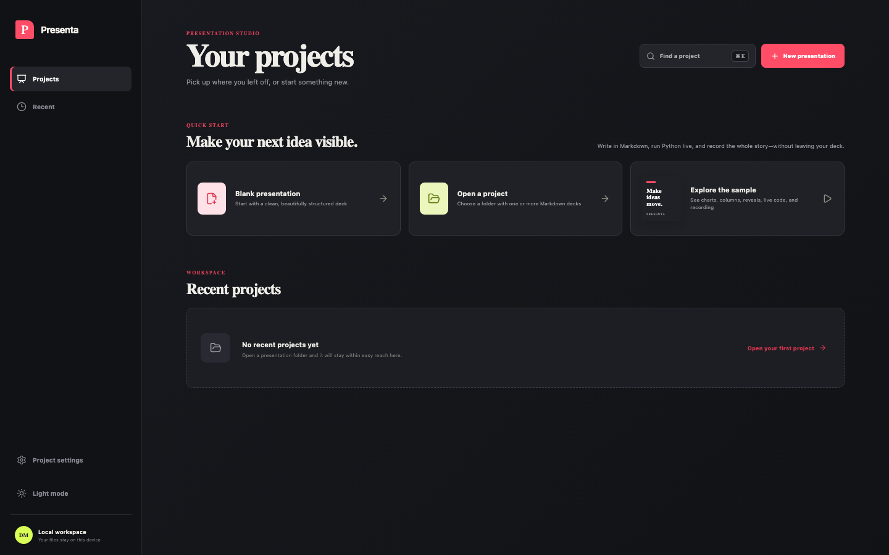
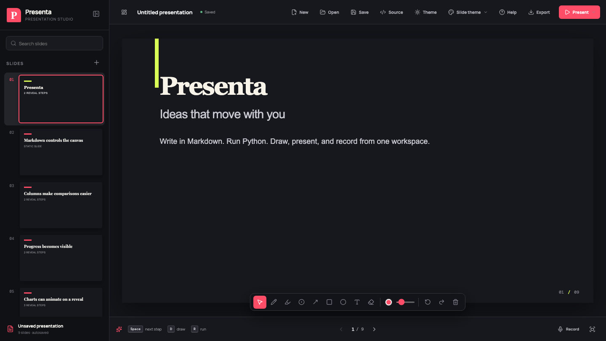

<p align="center">
  
</p>

<h1 align="center">Presenta</h1>

<p align="center">
  A local-first presentation studio for Markdown slides, live Python, vector ink,
  session recording, and export.
</p>

Presenta keeps the entire presentation workflow in one desktop workspace. Write a
deck in Markdown, run Python without losing state, reveal animated charts, annotate
slides, record your delivery, and export the result.



## Highlights

- **Markdown-native decks** with speaker notes, incremental reveals, columns,
  mathematics, tables, syntax highlighting, and custom slide backgrounds.
- **Persistent Python cells** powered by the opened project's `uv` environment in
  the desktop app, with a Pyodide fallback in the browser.
- **Animated ECharts** configured directly from fenced JSON blocks.
- **Presentation ink** with pen, highlighter, laser, arrows, shapes, text, eraser,
  undo, and redo tools.
- **Presenter recording** with narration, optional camera overlay, private speaker
  notes, a next-slide preview, and pause/resume support.
- **Flexible export** to PDF or session video, including step-by-step PDF output
  and H.264/AAC MP4 assembly through FFmpeg.
- **Local-first project storage** with configurable locations for generated state.



## Quick start

### Browser

```bash
npm install
npm run dev
```

Open the local URL printed by Vite. Choose **Explore the sample** on the project
dashboard to try a complete deck immediately. Browser mode stores drafts and
sessions in local storage; native folder operations are available in the desktop
build.

### Desktop

Install the [Tauri prerequisites](https://v2.tauri.app/start/prerequisites/) for
your platform, then run:

```bash
npm install
npm run tauri dev
```

Open a project folder containing one or more Markdown presentation files. Decks
may live at the project root or in subfolders and share the root-level `assets/`
directory.

## Authoring a deck

Use `---` between slides and add Presenta's optional directives where needed:

```markdown
# A new direction

The first idea appears immediately.

<!-- step -->

This idea is revealed next.

---

<!-- columns: 35 65 -->
<!-- column -->

## Context

Left-column content.

<!-- column -->

## Result

Right-column content.

???
Private presenter notes go here.
```

ECharts use an `echarts` fenced block containing a JSON option object. Standard
ECharts animation options determine how a chart animates. See
[How to Create a Presentation](CREATE_PRESENTATION.md) for the full authoring
guide.

## Controls

| Key | Action |
| --- | --- |
| <kbd>Space</kbd> / <kbd>→</kbd> | Next reveal or slide |
| <kbd>←</kbd> | Previous reveal or slide |
| <kbd>R</kbd> | Run the first Python cell on the slide |
| <kbd>A</kbd> | Replay visible chart animations |
| <kbd>D</kbd> / <kbd>L</kbd> / <kbd>E</kbd> | Pen / laser / eraser |
| <kbd>F</kbd> | Presentation mode |
| <kbd>Esc</kbd> | Return to select mode |

## Project storage

By default, Presenta keeps generated project state outside the project at
`~/.presenta/projects/<project-id>/`. In **Projects → Settings**, you can use the
operating system's application cache, keep state inside the project, or choose a
custom base folder.

When state is stored inside the project, the layout is:

```text
my-presentation-project/
├── presentation.md
├── decks/
│   └── quarterly-review.md
├── assets/
└── .presenta/
    ├── settings.json
    ├── drawings.json
    ├── outputs/
    ├── presentations/
    │   └── decks/
    │       └── quarterly-review.md/
    │           ├── drawings.json
    │           └── outputs/
    ├── sessions/
    └── exports/
```

Editable presentations and their required assets always remain in the project
tree. Presenta-owned settings, drawings, cached Python outputs, recordings, and
internal video exports use the selected settings location. The root-level
`presentation.md` stores its state directly there; other decks receive isolated
state under `presentations/<relative-path>/`.

Existing project-local `.presenta`, `drawings/`, and `outputs/` data remains
readable. Each recent project remembers its resolved settings folder, so changing
the preference affects newly opened or created projects without silently moving
existing data.

## Recording and export

Sessions are stored under `<settings-location>/sessions/<timestamp>/`, with
separate timeline, narration, frozen output, drawing, and optional visual-capture
data. Recording setup includes camera and microphone previews, device selection,
and camera position and size controls.

The mirrored camera preview can be moved and resized while recording and is composited at the
same location in the export. Presenter view shows private speaker notes, a timer,
and a next-slide preview; it is never included in the captured video. Paused time
is excluded from audio, video, events, and total duration. Each stopped recording
is retained as an independent section that can be replayed, removed, or retaken.

Choose **Session video** in Export to combine the current sections into an MP4.
PDF export supports final-state and step-by-step modes.

### macOS recording permissions

Use the stable debug app bundle when testing recording so macOS can retain its
microphone and screen-recording permissions between rebuilds:

```bash
npm run debug:macos
```

The macOS desktop app captures only the visible slide rectangle with the system
recorder and hardware video pipeline, then adds the selected microphone track.
Browser and non-macOS builds use the lower-resolution canvas fallback.

## License

See [LICENSE](LICENSE).
